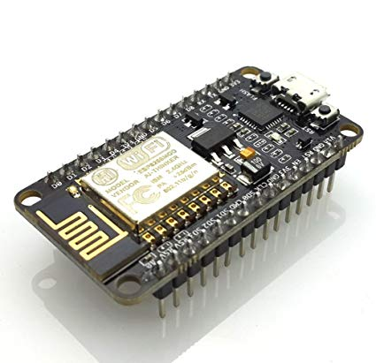
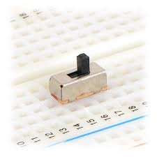
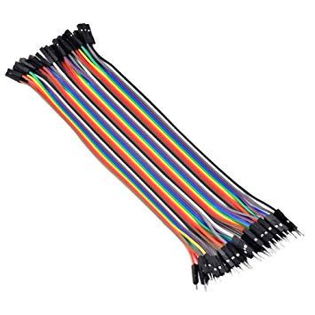

# WebLight - controle de dispositivos

#### Professor: Wilian França Costa

#### Autor:
- Pedro Padilha Farroco - 31825672

## Objetivo do Trabalho

Desenvolver uma solução utilizando os conceitos aprendidos em sala de aula a respeito de eletrônica, Arduino e afins.

## Descrição do Projeto

O projeto consiste em permitir que uma placa ESP8266 possa ser controlada remotamente, através do protocolo [MQTT](https://en.wikipedia.org/wiki/MQTT). O programa desenvolvido permite que ela escreva e leia valores de portas digitais e analógicas sem qualquer tipo de interação física entre o usuário ou sistema que faz a requisição e a placa, ou seja, permite que ela seja controlada de qualquer lugar do mundo (desde que haja uma conexão com a internet).

## Pré-requisitos

**1. Computador:** Embora o dispositivo utilizado seja o NodeMCU, utilizamos a IDE do Arduino para programá-lo. Ela pode ser encontrada [aqui](https://www.arduino.cc/en/Main/Software).

**2. IDE Arduino**: Na IDE, você deve instalar as placas da "família" ESP8266. Para isso, copie o link em [esp8266-board-download-link.txt](esp8266-board-download-link.txt) e cole no local especificado na janela de Preferências. (Ctrl + , ou ⌘ + ,). Depois, em Tools>Board>Board Manager, procure por ESP8266 e instale o pacote de placas.

**3. Pessoais:** Embora não seja necessário para a execução do projeto, é bom ter conhecimentos sobre a linguagem de programação do Arduino para entender o funcionamento e também fazer alterações no projeto, caso seja do seu interesse.

## Hardware
###### (Utilizaremos um LED e um switch para a demonstração)

1. NodeMCU

    

2. LED

    

3. Switch

    

4. Jumpers

    

## Instalação

1. Para clonar o repositório, utilize o comando a seguir:

    ```
    git clone https://github.com/pedropadilha13/WebLight.git
    ```

	Uma outra alternativa é baixar o projeto no formato zip, clicando no botão verde acima.

2. Na raiz do projeto, existe um diretório chamado "PubSubClient". Este diretório contém a biblioteca MQTT que a placa utilizará para conectar-se com o broker MQTT. Ele deve ser movido para o diretório ```Documents/Arduino/libraries```.

3. A placa que deve ser selecionada na lista de placas na IDE é a "NodeMCU 1.0 (ESP12-E Module)"

## Execução

Antes de enviar o código para a placa, você deve configurar o SSID e a senha da sua rede Wi-Fi no sketch. Isso é feito alterando a variável ```cred``` declarada no início do código. Depois disso, basta enviar o programa para a placa!

## Como funciona

A placa automaticamente se conecta à rede Wi-Fi configurada no programa e, logo em seguida, ao broker MQTT.

Ao receber uma nova mensagem em qualquer subtópico de pedropadilha13/weblight (#), o Arduino avalia a mensagem e, com base no comando recebido, age de acordo.

- `read`/`r`/`digitalRead`/`readDigital`:
	- Publica uma mensagem no tópico pedropadilha13/weblight/responses contendo o valor digital lido da porta especificada na mensagem
- `analogRead`/`readAnalog`:

	 - Publica uma mensagem no tópico pedropadilha13/weblight/responses contendo o valor analógico lido da porta especificada na mensagem
- `digitalWrite`/`writeDigital`/`write`/`w`:
	- Escreve o valor digital recebido na mensagem na porta especificada no subtópico de ```weblight```
- `analogWrite`/`writeAnalog`:
	- Escreve o valor analógico recebido na mensagem na porta especificada no subtópico de ```weblight```

## Exemplos

| tópico                                | mensagem | resultado                           |
|---------------------------------------|----------|-------------------------------------|
| pedropadilha13/weblight/write/2       | 1        | Escreve HIGH na porta D4            |
| pedropadilha13/weblight/read          | 4        | Lê o valor digital da porta D2      |
| pedropadilha13/weblight/analogWrite/2 | 100      | Escreve o valor 100 na porta PWM D4 |
| pedropadilha13/weblight/analogRead    | 2        | Lê o valor analógico da porta D4    |

##### Obs.: As ações (write, digitalRead, analogWrite etc) podem ser substituídas por outras equivalentes, o resultado será o mesmo.

## [listen.sh](listen.sh) e [send.sh](send.sh)

Estes arquivos servem apenas para simplificar o recebimento/envio de comandos.
- [listen](listen.sh): não recebe argumentos, apenas executa o comando `mosquitto_sub` no servidor e tópico corretos
- [send](send.sh): executa o comando `mosquitto_pub` - recebe dois argumentos, sendo eles:
    - $1: comando, ou seja, a última parte do tópico (o que vem depois de `pedropadilha13/weblight/`)
    - $2: a mensagem (porta a ser manipulada/lida)

## Demo (vídeo)

[](https://youtube.com/pedropadilha13/)

## License

This project is licensed under the MIT License - see [LICENSE](LICENSE) for details
